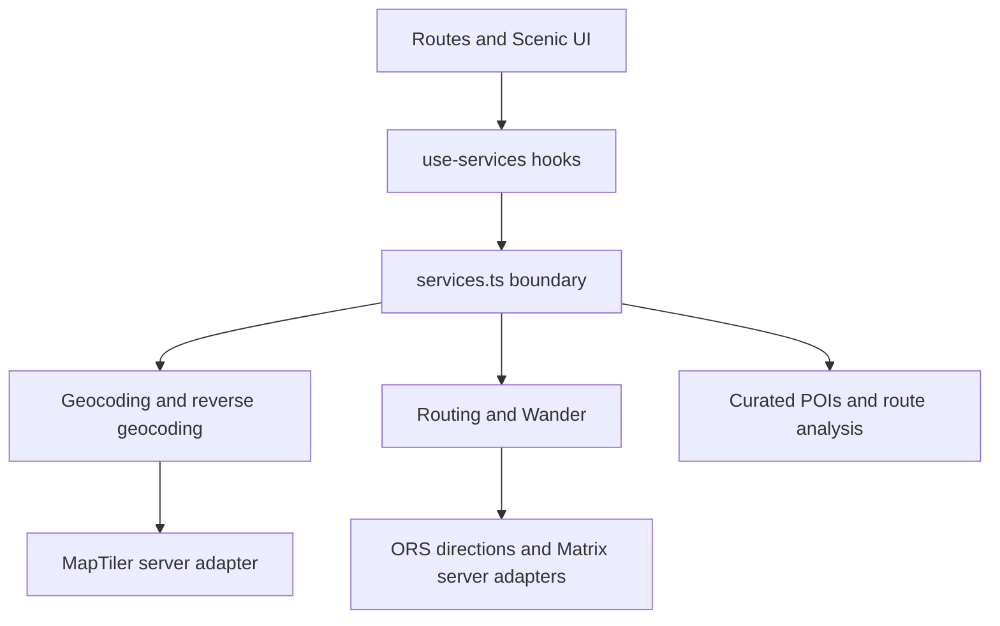
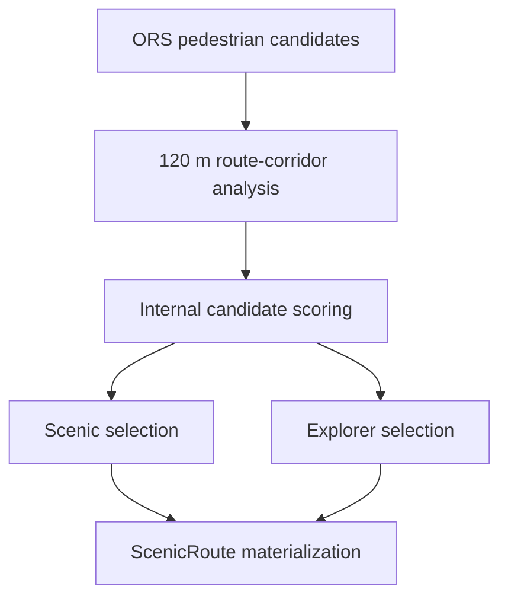
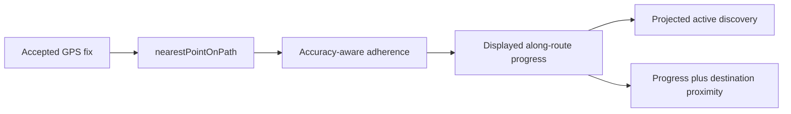

# Scenic Route

Scenic Route is a mobile-first Paris walking application that helps people reach a real destination while taking a more interesting pedestrian route.

Instead of optimizing only for minimum travel time, the app compares real pedestrian-route candidates against curated discoveries and user interests, while keeping detour and time constraints explicit.

> **Development status:** functional MVP architecture. Core provider-backed routing, navigation, device-local feedback/personalization, and sharing are implemented. Test source and manual CI scaffolding exist, but the dependency and browser-test stack must pass the local validation gate before real-world route evaluation begins.

Scenic Route is not described here as production-ready, fully tested, or validated by walking in Paris. The prompt that originally seeded the prototype is preserved separately as the [Original Scenic Route Product Brief](docs/original-product-brief.md); it is historical context, not an implementation specification.

## What Scenic Route Does

The current application lets a user:

- choose seeded or MapTiler-searched Paris start and destination places;
- use the device's current foreground location as either endpoint;
- select explicit interests, walking pace, units, and a `+10`, `+20`, or `+30` minute ordinary-route detour allowance;
- compare Fastest, Scenic, and Explorer route profiles;
- use **I have time to explore** (Wander) with a 10–120 minute total budget and a required destination;
- navigate eligible real routes with continuous GPS progress, accuracy feedback, off-route warnings, recovery, and arrival detection;
- see curated discoveries in their real order along the chosen route, inspect details, and save discoveries;
- save a completed route summary and submit explicit route feedback;
- use conservative, deterministic, device-local preference learning on later trips; and
- share eligible real routes through portable, validated links without a Scenic Route backend.

## Route Profiles and Fallbacks

### Fastest

Fastest is the direct OpenRouteService (ORS) pedestrian baseline when ORS is available. It is the default selection on Plan, has no discovery personalization, and provides the baseline used to calculate other profiles' extra time.

### Scenic

Scenic is the highest-scoring eligible candidate among the real pedestrian candidates currently returned by ORS. Eligibility respects the user's hard detour cap. Candidate scoring uses curated POIs near each route; it does not fabricate a scenic path.

### Explorer

Explorer favors a discovery-backed candidate with more discoveries and better spread while remaining within the detour cap. Selection attempts to remain distinct from both Fastest and Scenic; if no suitable real Explorer candidate exists, the product can show a synthetic Preview alternative instead.

### Wander / I Have Time

Wander treats the chosen minutes as a total walking-time budget toward a required destination—not as a sightseeing loop and not as the ordinary detour cap. It can use an ORS duration Matrix to evaluate sequences containing one or two curated routing anchors, then requests a real ORS via route. Depending on feasibility it returns a targeted, direct-only, or insufficient-time real route, or a Preview when ORS is unavailable.

### Real routes versus Preview routes

The product has two visibly different route sources:

1. **Provider-backed routes** use ORS pedestrian-network geometry and can become navigation-ready.
2. **Synthetic Preview routes** keep planning usable when ORS is unavailable or cannot supply a suitable alternative. They are estimates based on mock geometry and are **not navigation-ready**.

Only a route whose `routingSource` is `openrouteservice` passes the central guard in [`navigation.ts`](src/lib/scenic/navigation.ts) and can enter live navigation. Preview is not equivalent to real routing.

The deterministic server-side E2E fixture described under [Testing](#testing) is a third, test-only mechanism: it behaves as an ORS test double and exercises the normal analysis, scoring, and selection pipeline. It is not the product Preview generator.

## Design and Product Principles

- The destination still matters, including in Wander.
- Extra time is explicit and ordinary-route detour caps are hard eligibility constraints.
- Route explanations should say what makes a route interesting without fake match percentages or unsupported road-quality claims.
- The experience supports incidental discovery rather than pretending to be a formal guided tour.
- Precise live location stays in memory by default.
- Provider geometry is preferred over fabricated scenic paths.
- Explicit interests have more influence than learned preferences.

## Tech Stack

The native-distribution foundation and its security boundary are documented in
[Native mobile foundation](docs/native-mobile.md).

| Area                      | Current implementation                                       |
| ------------------------- | ------------------------------------------------------------ |
| Language and UI           | TypeScript, React 19                                         |
| Application framework     | TanStack Router and TanStack Start                           |
| Build and styling         | Vite 8, Tailwind CSS 4, Cloudflare Workers Vite integration  |
| Map                       | MapLibre GL JS with the OpenFreeMap Liberty style by default |
| Package/runtime tooling   | Bun (with npm-compatible scripts also used in CI)            |
| Unit tests                | Vitest, Node test environment                                |
| Walking routes and Matrix | OpenRouteService (`foot-walking`)                            |
| Forward/reverse geocoding | MapTiler Geocoding API                                       |

Radix UI primitives and local Scenic components provide the interface. The application does not currently integrate speculative POI providers such as Foursquare, Wikidata, OpenTripMap, Google Maps, or Overpass.

## Architecture



[`src/lib/scenic/services.ts`](src/lib/scenic/services.ts) is the application service boundary. Route pages consume it directly or through [`use-services.ts`](src/lib/scenic/use-services.ts); contributors should not add direct provider HTTP calls to UI routes. Credential-bearing MapTiler and ORS calls live in TanStack server functions in `*.server.ts` modules.

The ordinary route pipeline is:



Scoring considers scenic editorial value, landmark quality, explicit interest match, bounded learned preference, discovery spread, and a detour penalty. Selection then enforces the appropriate eligibility and distinctness policies. See [Architecture](docs/architecture.md) for the detailed route, navigation, persistence, learning, and sharing flows.

### Real-route geometry invariant

> Provider-backed routes use the `LineString` returned by OpenRouteService. Scenic Route may analyze, score, and select among candidate routes, but it does not manually weave POIs into real provider geometry.

Preserving every provider vertex supports pedestrian-network trust, consistent route identity and sharing, and correct route projection during navigation. Explicit server-side test fixtures are the only controlled exception and can run only outside production.

### OpenRouteService routing

ORS adapters use the current `https://api.heigit.org/openrouteservice/v2` host and the `foot-walking` profile:

- ordinary routing requests the shortest route plus a bounded ORS alternatives request with `target_count: 3`;
- response normalization accepts distinct valid GeoJSON `LineString` features and leaves their vertices untouched;
- the first provider-ranked candidate is the direct Fastest baseline;
- Wander uses the duration Matrix to plan possible anchors, then a fixed 2–4 point via-directions request with no alternatives; and
- unavailable credentials, timeouts, or invalid provider responses fail safely into Preview/direct-only behavior as applicable.

API credentials never belong in client code or this README.

### MapTiler geocoding

MapTiler supplies Paris-bounded forward location search and best-effort reverse label enrichment for a device GPS fix. Seeded places remain a forward-search fallback when MapTiler is unavailable. Adapter-provided GPS coordinates are authoritative: reverse geocoding may improve a label, but never moves the fix.

### Map rendering

[`ParisMap.tsx`](src/components/scenic/ParisMap.tsx) renders GeoJSON with MapLibre and defaults to OpenFreeMap Liberty. It uses zero GeoJSON source tolerance so real route vertices are not simplified or smoothed. If MapLibre cannot load or initialize within its startup window, the application uses [`LegacyParisMap.tsx`](src/components/scenic/LegacyParisMap.tsx); that fallback also avoids smoothing ORS geometry.

## Curated Paris POIs

The bundled [`pois.ts`](src/lib/scenic/pois.ts) currently contains **98** editorially curated POIs across **14 arrondissements**: 1–10, 12, and 16–18. This is intentionally not a claim of all-20-arrondissement coverage. Distribution is uneven because curation quality and meaningful pedestrian anchors take priority over a quota.

Each POI has:

- one of 19 typed categories;
- descriptive editorial content and internal 0–10 editorial inputs;
- interest tags and an approximate editorial visit duration; and
- an arrondissement, neighborhood, and coordinate chosen as a meaningful pedestrian anchor where practical.

[`poi-validation.ts`](src/lib/scenic/poi-validation.ts) validates identifiers, text, coordinates, categories, scores, interests, and dataset-wide interest coverage when the module is loaded. The source and access research, coordinate rationale, coverage audits, and caveats are recorded in [POI expansion 10.2](docs/poi-expansion-10.2.md) and [POI expansion 10.3](docs/poi-expansion-10.3.md).

### Route-corridor discoveries

Standard Scenic and Explorer routes do not add discoveries as waypoints. The flow is **real route → geometric corridor analysis → nearby curated POIs**. [`route-analysis.ts`](src/lib/scenic/route-analysis.ts) defines the current default corridor radius of **120 metres**, projects each POI onto the route, and records its distance from and distance along the route.

Corridor proximity means only that a POI is geometrically near the route; it is not by itself a guarantee of access or a walking instruction. Wander routing anchors are an explicit and separate mechanism.

## Scenic Candidate Scoring

[`route-scoring.ts`](src/lib/scenic/route-scoring.ts) contains the inspectable deterministic heuristic. It combines:

- scenic editorial value;
- landmark quality derived from the curated editorial fields;
- explicit selected-interest matches;
- a bounded learned-preference blend;
- discovery spread along route quarters; and
- an extra-time detour penalty.

Scores are internal, unitless ranking values—not percentages, reviews, probabilities, or objective route-quality claims. The UI does not present a fabricated percent match. Explicit interests dominate learned preference, and no score can override the hard detour eligibility cap. Numeric tuning remains in the implementation rather than being duplicated here.

## Feedback and Preference Learning

Eligible completed real routes accept one explicit rating—**Loved it**, **It was okay**, or **Not for me**—and optional liked aspects such as history, architecture, hidden places, or food and cafés. These records are bounded and device-local.

[`preference-learning.ts`](src/lib/scenic/preference-learning.ts) turns recent explicit signals into capped interest affinities through deterministic weighted logic. It is not an AI recommendation model. A learned-preference snapshot is frozen into a new `TripPlan`; feedback submitted on Complete can affect later plans but does not rerank the completed trip. Explicit interests remain stronger than learned affinities.

## Local Persistence

The browser store in [`store.ts`](src/lib/scenic/store.ts) uses localStorage key **`scenic-route:v1`** and schema **version 4**. It persists:

- preferences (interests, detour cap, pace, units, and intro state);
- saved route summaries;
- saved discovery IDs;
- the current `TripPlan`, including its frozen learned-preference snapshot; and
- validated explicit route-feedback records.

Saved routes intentionally preserve summaries, so this is not a claim that the app stores no route information. Continuous GPS fixes and adherence history are not store fields. A trip endpoint selected as Current location persists only the `live-current-location` sentinel, not the precise coordinates.

## Location and Privacy

- No account is required; application state is device-local.
- A current precise location fix is held in module memory for the current session.
- A current-location `TripPlan` stores a sentinel instead of precise coordinates.
- `watchPosition` navigation fixes, off-route history, and skipped discoveries remain runtime-only and are not written to localStorage.
- Reverse geocoding is best-effort label enrichment and does not replace device coordinates.
- A share created from Current location requires an explicit disclosure before static start/end coordinates are encoded into the link.

These are implementation invariants, not a broad legal or regulatory compliance claim.

## Live Navigation

Only provider-backed routes can start navigation. [`use-navigation-location.ts`](src/lib/scenic/use-navigation-location.ts) uses the centralized location provider; web delegates to `navigator.geolocation`, while Capacitor iOS and Android delegate to `@capacitor/geolocation`. A fix is usable only inside the supported Paris bounds and with reported accuracy at or below 100 metres. Poor fixes do not replace the last usable fix.



Navigation projects physical location onto the selected route with `nearestPointOnPath`. It suppresses only small backward projection jitter; real backtracking remains visible. Accuracy-aware hysteresis requires consecutive away fixes before confirming off-route, freezes displayed progress while confirmed off-route, and requires consecutive reliable near-route fixes to recover. Arrival likewise requires both near-end route progress and physical destination proximity across multiple fixes.

### Discovery sequencing

[`navigation-discoveries.ts`](src/lib/scenic/navigation-discoveries.ts) projects every displayed POI onto the actual selected path and orders it by distance along that route. Active discovery selection therefore does **not** use `route progress × discovery count` and does not show fabricated POI ETAs. Skipped discovery IDs exist only in the navigation component's runtime state.

## Route Sharing

Share links are backend-free, URL-fragment encoded, bounded, and validated before use. They contain endpoints, mode/profile, route identity, route preferences, discovery IDs, expected summary values, and—only for targeted Wander—validated curated waypoint IDs.

They do **not** contain route geometry, learned-preference profiles, feedback, or GPS history. The recipient requests the route from ORS, reconstructs it, and verifies the stable route identity; malformed input is rejected, and provider changes or unavailable routing are surfaced rather than silently trusted. Only real ORS routes are share-eligible.

## Project Structure

```text
src/
  routes/                     TanStack route pages
  components/scenic/          Product UI and map components
  lib/scenic/
    services.ts               Provider and domain-service boundary
    use-services.ts           React adapters for route services
    types.ts                  Domain contracts
    store.ts                  Versioned device-local state
    pois.ts                   Curated Paris POIs
    poi-validation.ts         Dataset validation
    route-analysis.ts         Route-corridor projection
    route-scoring.ts          Internal candidate scoring
    route-selection.ts        Scenic and Explorer selection
    wander-routing.ts         Wander planning/materialization
    navigation-location.ts    GPS fix normalization
    navigation-progress.ts    Route projection/progress
    navigation-adherence.ts   Off-route hysteresis
    navigation-discoveries.ts Discovery placement/sequencing
    preference-learning.ts    Deterministic local learning
    shared-route.ts           Portable share contract
    *.server.ts               Credential-bearing provider adapters/fixtures
docs/                         Testing, architecture, audit, and research docs
scripts/audit-walking-route.mjs
```

## Local Development

Bun is the primary package manager:

```bash
git clone https://github.com/Raekwaanza/wander-paris-ways.git
cd wander-paris-ways
bun install
cp .env.example .env
bun run dev
```

On Windows, manually copy `.env.example` to `.env` if `cp` is inconvenient. Add only your own local credentials; do not commit `.env`.

The web Vite configuration uses the official Cloudflare Workers, TanStack Start, React, and
Tailwind CSS integrations. It keeps `src/server.ts` as the custom Worker entry. The separate
mobile configuration intentionally omits the Cloudflare plugin and creates only the Capacitor SPA
assets. See [Cloudflare deployment](docs/deployment.md) for the production workflow.

### Environment variables

| Variable                        | Exposure                    | Current behavior                                                                                                                                                                                                             |
| ------------------------------- | --------------------------- | ---------------------------------------------------------------------------------------------------------------------------------------------------------------------------------------------------------------------------- |
| `OPENROUTESERVICE_API_KEY`      | Server-only secret          | Enables real ORS `foot-walking` directions, alternatives, Wander Matrix planning, and Wander via requests. Absence or provider failure uses safe fallbacks. Never prefix it with `VITE_`.                                    |
| `MAPTILER_API_KEY`              | Server-only secret          | Enables Paris forward search and best-effort reverse labels for GPS. Seeded search and the unmodified GPS fix remain available when absent. Never prefix it with `VITE_`.                                                    |
| `VITE_SCENIC_DATA_MODE`         | Public, non-secret          | Accepts `mock` or `live`, defaulting invalid/missing values to `mock`. The current hybrid services attempt keyed server providers regardless; `live` is reserved, warns, and does not activate a complete live provider set. |
| `VITE_SCENIC_MAP_STYLE_URL`     | Public, non-secret          | Overrides the MapLibre style; defaults to `https://tiles.openfreemap.org/styles/liberty`.                                                                                                                                    |
| `VITE_SCENIC_API_BASE_URL`      | Public, non-secret          | HTTPS origin of the deployed Scenic Route backend. Required in mobile builds for provider-backed features; never contains provider credentials or a path.                                                                    |
| `SCENIC_NATIVE_ALLOWED_ORIGINS` | Server-only security config | Optional comma-separated additions to the narrow `/api/v1/*` CORS allowlist. Origin is not authentication.                                                                                                                   |
| `SCENIC_E2E_FIXTURES`           | Server-only test flag       | `1` activates deterministic provider fixtures only when `NODE_ENV !== "production"`. Do not treat it as normal app configuration.                                                                                            |

### Available scripts

These are the scripts currently declared in `package.json`:

| Command              | Purpose                                                             |
| -------------------- | ------------------------------------------------------------------- |
| `bun run dev`        | Start the Vite development server.                                  |
| `bun run build`      | Create a production build.                                          |
| `bun run build:dev`  | Build in Vite development mode.                                     |
| `bun run preview`    | Preview a built application locally.                                |
| `bun run lint`       | Run repository-wide ESLint (currently affected by historical debt). |
| `bun run format`     | Format the repository with Prettier.                                |
| `bun run test`       | Run committed Vitest suites once.                                   |
| `bun run test:watch` | Run Vitest in watch mode.                                           |

There is currently no `test:e2e` or `test:e2e:live` package script. Those names appear in the future validation gate but are not available until the Playwright layer is implemented.

## Testing

Vitest is declared and Node-environment source suites cover route analysis/scoring/selection, Wander, navigation progress/adherence/discoveries, trip endpoints, feedback/learning, sharing, geometry, and deterministic provider fixtures. A server-only deterministic fixture seam is committed.

The repository does **not** yet contain `@playwright/test`, Playwright configuration/specs, or browser-test scripts. Test source and CI scaffolding exist, but the dependency/test stack has not yet been fully validated in the previously constrained cloud environment. Do not interpret committed tests as a claim that all tests pass.

`SCENIC_E2E_FIXTURES=1` replaces ORS/Matrix provider responses inside server functions so future deterministic browser tests traverse the normal route pipeline. Fixture activation refuses production (`NODE_ENV === "production"`). This differs from ordinary Preview routes, which are a user-visible product fallback with `routingSource: "mock"`.

### CI status

[`.github/workflows/ci.yml`](.github/workflows/ci.yml) is scaffolding with a manual `workflow_dispatch` trigger only. It pins Bun 1.2.14, uses `bun install --frozen-lockfile`, and runs independent **Unit tests** (`npm test`) and **Production build** (`npm run build`) jobs. It has not been characterized here as green. Automatic pull-request and main-branch triggers remain blocked until local validation.

### Before field testing

> **Do not begin route-quality data collection until the local validation gate in [`docs/testing.md`](docs/testing.md) has passed.** CI scaffolding alone does not satisfy that gate.

The testing document is authoritative for the current unit/browser structure, pre-field commands, manual CI state, and future live ORS smoke expectations.

## Known Development Constraints

- Repository-wide ESLint has known historical formatting errors and warnings and is not yet a CI gate.
- A full TypeScript `noEmit` check has existing application issues and is not currently a package script or CI gate.
- The Playwright browser layer and its scripts remain absent and unexecuted.
- Dependency-registry access in the prior Codex Cloud environment has been unreliable, which is why local frozen-install and execution validation remains explicit.
- Recent project reports record a successful production build, but the current cloud attempt was blocked at dependency installation; a build alone would not validate providers, tests, or real-world routes.

These constraints are tracked honestly without changing product runtime behavior in this documentation step.

## Credentials

- Never commit API keys; keep `.env` local.
- ORS and MapTiler keys are server-only. Never expose them through `VITE_*` variables.
- Never add credentials to shared-route links or browser localStorage.
- Use provider secrets only through the existing server adapters.

## Current Development Stage

Implemented architecture includes real provider-backed routing, Scenic/Explorer ranking, destination-oriented Wander, GPS progress, off-route handling and recovery, route-projected discovery sequencing, local feedback/learning, validated route sharing, Vitest source scaffolding, deterministic provider fixtures, and manual CI scaffolding.

Immediate work remains local dependency/test validation, completion of the Playwright browser layer, and later automatic CI activation. Upcoming work is a real-world Paris test build, route-evaluation tooling, and evidence-based routing/scoring tuning. Field testing has not started and remains behind the documented gate.

## Developer Documentation

- [Architecture](docs/architecture.md): service boundary, route generation, Wander, navigation, persistence, preference learning, and sharing identity.
- [Testing and the pre-field-test gate](docs/testing.md): current test structure, missing browser layer, manual CI, and live ORS smoke expectations.
- [Routing quality audit](docs/routing-quality-audit.md): route geometry flow, developer ORS audit tool, Snap diagnostics, GeoJSON output, and endpoint-offset diagnostics.
- [POI expansion 10.2](docs/poi-expansion-10.2.md) and [POI expansion 10.3](docs/poi-expansion-10.3.md): research methodology, sources, access caveats, pedestrian-anchor rationale, and coverage.
- [Original Scenic Route Product Brief](docs/original-product-brief.md): historical prototype/product intent; not current implementation documentation.

## Historical project connection

The repository retains historical Lovable project metadata and its existing Git synchronization
warning, but Lovable is not part of the application build or runtime dependency chain. Do not
rewrite published history—avoid force pushes, rebasing or squashing already-pushed commits, and
amending already-pushed commits. See [`AGENTS.md`](AGENTS.md) for the canonical instruction.
