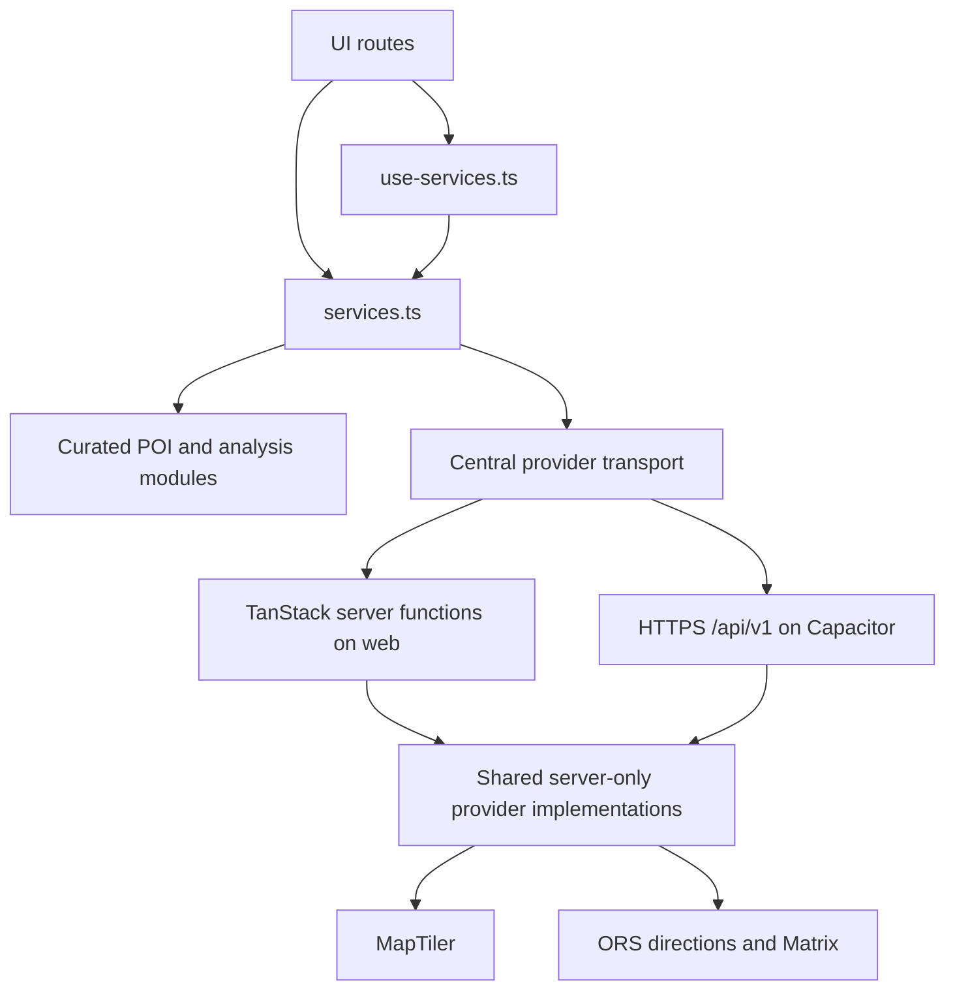
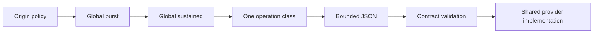
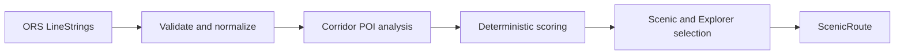
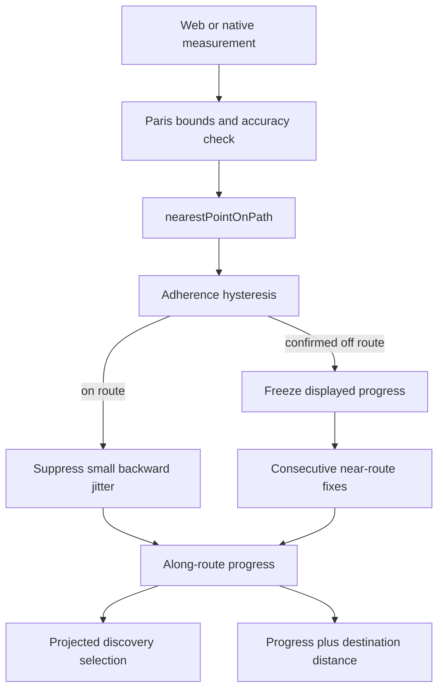

# Scenic Route architecture

This document expands the implementation overview in [README.md](../README.md). It describes the current code rather than the historical product brief.

## Build boundary

`vite.config.ts` composes the official Cloudflare Workers, TanStack Start, React, Tailwind CSS, and
native Vite tsconfig-path integrations directly. It builds the SSR application for a direct
Cloudflare Worker deployment and keeps `src/server.ts` as the custom server entry.
`vite.mobile.config.ts` intentionally omits the Cloudflare plugin and enables TanStack Start's SPA
prerendering for the dedicated Capacitor client bundle. No Lovable package is required by either
build.

The Tailwind CSS 4 visual-token architecture is centralized in `src/styles.css`: raw Scenic brand
primitives map to semantic UI tokens consumed by shared components and screens. Night is the
default, with an optional scoped Day foundation. See the canonical
[Scenic Route design system](design-system.md); cartographic styling remains a separate map-layer
concern.

## Domain and service boundary

Domain contracts live in [`src/lib/scenic/types.ts`](../src/lib/scenic/types.ts). UI routes and Scenic components assemble user flows, while [`services.ts`](../src/lib/scenic/services.ts) owns the provider-facing interfaces for geocoding, reverse geocoding, POIs, walking routing, Wander, and route analysis. React request lifecycle handling lives in [`use-services.ts`](../src/lib/scenic/use-services.ts).

Credential-bearing HTTP requests remain in shared server-only implementations. Thin TanStack
server-function wrappers serve the browser, and narrow `/api/v1/*` route handlers invoke the same
implementations for Capacitor clients:

- [`maptiler-geocoding.server.ts`](../src/lib/scenic/maptiler-geocoding.server.ts) wraps the forward and reverse MapTiler implementation. [`reverse-geocoding.server.ts`](../src/lib/scenic/reverse-geocoding.server.ts) provides the compatibility export.
- [`openrouteservice-routing.server.ts`](../src/lib/scenic/openrouteservice-routing.server.ts) wraps ordinary alternatives and fixed via routes.
- [`openrouteservice-matrix.server.ts`](../src/lib/scenic/openrouteservice-matrix.server.ts) wraps Wander duration matrices.
- [`e2e-provider-fixtures.server.ts`](../src/lib/scenic/e2e-provider-fixtures.server.ts) supplies deterministic provider results only under the guarded server-side test flag.

### Native API abuse-control boundary

[`native-api.server.ts`](../src/lib/scenic/native-api.server.ts) centralizes the native endpoint
pipeline. After exact-origin validation, every POST runs the global burst and sustained Cloudflare
Rate Limiting bindings followed by exactly one `geocoding`, `routing`, or `matrix` class binding.
Only an allowed request proceeds to bounded JSON reading, contract validation, and the shared
provider implementation. Preflight bypasses rate limiting, while binding failure fails closed
before provider execution.

The server-only Cloudflare adapter reads `CF-Connecting-IP` as a coarse counter key and uses one
deterministic local fallback. It never exposes or persists that value. The native bundle contains
no limiter credential or persistent device identifier. A rejection preserves CORS and returns a
non-cacheable `429` with a retry window; native transport maps that non-success response to the
existing controlled unavailable/Preview semantics.

`VITE_SCENIC_DATA_MODE` currently configures the hybrid boundary rather than switching off keyed server operations. The hybrid set uses curated POIs, attempts MapTiler/ORS server calls when keys exist, and safely falls back when they do not. A complete `live` provider set is not implemented, so configured `live` mode warns and the service reports its active mode as `mock`.

## Ordinary route generation

1. The UI resolves the `TripPlan` endpoints into runtime `Place` values.
2. The route service requests ORS `foot-walking` directions with a bounded alternatives request.
3. Valid, distinct GeoJSON `LineString` features become `WalkingRouteCandidate` values. Provider rank zero is the direct baseline.
4. [`route-analysis.ts`](../src/lib/scenic/route-analysis.ts) projects curated POIs onto every candidate and retains those inside the default 120-metre corridor.
5. [`route-scoring.ts`](../src/lib/scenic/route-scoring.ts) evaluates existing corridor facts against the direct baseline. It does not route, insert POIs, or mutate geometry.
6. [`route-selection.ts`](../src/lib/scenic/route-selection.ts) chooses the best eligible Scenic candidate and, when available, a distinct discovery-focused Explorer candidate.
7. [`services.ts`](../src/lib/scenic/services.ts) materializes the chosen candidates as `ScenicRoute` objects using their original provider paths.

### Geometry and identity

Provider path vertices are never replaced with a hand-built POI path. This preserves the meaning of provider distance/duration, network walkability, map display, GPS projection, and stable route identity. [`route-geometry.ts`](../src/lib/scenic/route-geometry.ts) is the canonical rendering gate: it accepts only paths with at least two finite, in-range coordinates, returns the original path without interpolation, and performs the sole MapLibre format conversion from `{ lat, lng }` to `[lng, lat]`. A provider-labelled route with invalid geometry produces no line and cannot enter navigation or sharing. The MapLibre source uses zero tolerance to avoid route simplification; the legacy renderer avoids smoothing real ORS routes.

Ordinary stable IDs separate Fastest identity from alternative candidate geometry. Sharing uses those IDs to detect a route that can no longer be reconstructed. Test fixture geometry is permitted only as an ORS test double outside production and still flows through normalization, analysis, scoring, and selection.

### Route semantics

- **Fastest** is provider rank zero, materialized as the direct unpersonalized baseline and selected by default on Plan.
- **Scenic** is the highest internal score that satisfies the detour cap, with a baseline fallback inside the real-candidate selection policy.
- **Explorer** considers discovery-backed, within-cap candidates and prioritizes discovery count and spread while avoiding Scenic duplication when possible.
- If ORS or a suitable real alternative is unavailable, corresponding synthetic routes from [`routing.ts`](../src/lib/scenic/routing.ts) remain Preview-only and fail the navigation guard.

## Wander planning

Wander's input is a total time budget and a required destination. It deliberately ignores the ordinary route detour-cap value.

1. Request the direct ORS route and analyze its corridor.
2. Return an `insufficient-time` direct route when the destination cannot fit within the bounded budget tolerance.
3. Return `direct-only` if insufficient extra room or no useful anchors exist.
4. [`wander-routing.ts`](../src/lib/scenic/wander-routing.ts) shortlists curated anchors using geometry, editorial value, explicit interests, and bounded learned preferences.
5. Request an ORS `foot-walking` duration Matrix for start, anchors, and destination.
6. Evaluate feasible one-/two-anchor sequences, then make a bounded number of fixed via-directions attempts.
7. Recheck the real via duration, analyze its actual corridor discoveries, score successful candidates, and materialize the chosen `targeted` route.
8. When direct ORS routing is unavailable, return a synthetic `preview` Wander route.

Routing anchors are not automatically claimed as discoveries. Displayed discoveries still come from corridor analysis of the returned route.

## Location and navigation pipeline

Current-location endpoint acquisition and active navigation are distinct:

- [`location-provider.ts`](../src/lib/scenic/location-provider.ts) centrally selects browser geolocation on web or Capacitor Geolocation on iOS/Android and emits the same neutral measurement contract.
- [`current-location.ts`](../src/lib/scenic/current-location.ts) performs a one-time high-accuracy request through that provider, keeps the fix in module memory, and requests a best-effort reverse label.
- [`trip-endpoints.ts`](../src/lib/scenic/trip-endpoints.ts) converts that place into a persistable `live-current-location` sentinel.
- [`use-navigation-location.ts`](../src/lib/scenic/use-navigation-location.ts) starts and clears the selected foreground location watch for live navigation. It stops while the document is hidden, restarts on foreground resume, and never updates the persisted trip endpoint.

[`navigation-location.ts`](../src/lib/scenic/navigation-location.ts) rejects fixes outside supported bounds or with missing/greater-than-100-metre accuracy. [`navigation-progress.ts`](../src/lib/scenic/navigation-progress.ts) projects a usable fix onto physical route length and suppresses only sub-30-metre backwards jitter. Larger backwards movement is retained.

[`navigation-adherence.ts`](../src/lib/scenic/navigation-adherence.ts) applies accuracy-aware near/far thresholds. Three consecutive away fixes confirm off-route; two consecutive reliable near-route fixes recover. The route page freezes displayed progress during confirmed off-route state. Arrival requires at least 98.5% route progress and physical proximity within 50 metres for two fixes. These thresholds are implementation constants, not provider guarantees.

[`navigation-discoveries.ts`](../src/lib/scenic/navigation-discoveries.ts) independently projects discoveries onto the selected path and sequences them by physical distance along it. Skip state is component memory only; no fabricated ETA is calculated.

## Persistence, privacy, and learning

[`store.ts`](../src/lib/scenic/store.ts) persists version 4 under `scenic-route:v1`. Hydration validates/migrates the trip and validates feedback and its optional learning snapshot. Persisted classes are preferences, saved route summaries, saved discovery IDs, the current trip, and up to 100 explicit feedback records.

Precise coordinates for a MapTiler-selected static endpoint are part of that endpoint, but a current-location endpoint persists only its sentinel. Continuous navigation fixes, adherence counters/history, arrival counters, and skipped discoveries never enter the store.

When a route or Wander trip is created, the UI derives a snapshot from recent valid feedback and stores that abstract snapshot on the `TripPlan`. The route hooks use the frozen trip value. Complete-page feedback is therefore future-facing and cannot rerank the trip just completed. [`preference-learning.ts`](../src/lib/scenic/preference-learning.ts) bounds recent evidence and affinity strength; [`route-scoring.ts`](../src/lib/scenic/route-scoring.ts) further caps learned blending so an explicit POI interest match remains stronger.

## Sharing and reconstruction

[`shared-route.ts`](../src/lib/scenic/shared-route.ts) defines a versioned, bounded payload encoded into the URL fragment. Only real ORS routes can produce it. It contains static rounded endpoints, route mode/profile/identity, explicit interests and planning options, discovery IDs, expected summaries, and validated targeted-Wander anchor IDs when applicable.

The payload deliberately excludes geometry, learned preferences, feedback, and GPS history. A current-location trip must pass the Complete-page disclosure before its resolved static endpoints enter the fragment.

The shared page decodes and validates the payload, then the routing service requests ORS again:

- Fastest must reproduce its stable endpoint-derived identity.
- Scenic/Explorer must contain the geometry-derived candidate identity among the new candidates.
- Wander must reproduce the stable identity for its direct or validated curated-anchor via route.

The result is `exact`, `changed`, or `unavailable`; input from an arbitrary URL is never trusted as route geometry.

## Maps and graceful fallback

[`ParisMap.tsx`](../src/components/scenic/ParisMap.tsx) dynamically starts MapLibre using the configured public style. It renders paths as GeoJSON, the current device location separately from route endpoints, and curated discovery markers. Startup failure, WebGL failure, or a timeout activates [`LegacyParisMap.tsx`](../src/components/scenic/LegacyParisMap.tsx). This map fallback is separate from a route Preview fallback: map rendering can fall back while the underlying route remains real.

### Audited route-geometry surfaces

| Surface                                 | Route object and final line source                                                                              | Preview condition                                                                                                 |
| --------------------------------------- | --------------------------------------------------------------------------------------------------------------- | ----------------------------------------------------------------------------------------------------------------- |
| Landing demo                            | Scenic result from `useRoutes`; its own canonical `path`                                                        | The demo route is a labelled mock Preview only when a suitable ORS result is unavailable.                         |
| Explore/home planning                   | No route line; endpoints and discovery markers only                                                             | Not applicable.                                                                                                   |
| Plan Fastest/Scenic/Explorer comparison | Three distinct `ScenicRoute` objects; each feature uses that route's own canonical `path`                       | A profile may be a clearly labelled mock Preview when ORS or a suitable real alternative is unavailable.          |
| Selected-route preview                  | The active comparison route's canonical `path`; selection changes styling only                                  | Same explicit profile Preview semantics as Plan.                                                                  |
| Wander                                  | `WanderRoute.path`, which is the final ORS via result for targeted Wander                                       | Mock path only for `wander.fit === "preview"`; direct-only and insufficient-time retain the real direct ORS path. |
| Active navigation                       | The provider route's canonical `path` supplies both map GeoJSON and GPS projection/adherence/discovery progress | Preview and invalid provider geometry fail the navigation guard and show no route line.                           |
| Completion                              | Reconstructed trip route's canonical `path`                                                                     | A reconstruction that is only Preview remains visibly estimated and is not treated as a completed real route.     |
| Shared route                            | Only `status === "exact"` supplies the reconstructed ORS route's canonical `path`                               | `changed` and `unavailable` show endpoints and summary only, with no fabricated line.                             |
| Saved                                   | No saved-route geometry exists; the map shows saved discovery markers only                                      | Not applicable.                                                                                                   |

Both MapLibre and the legacy SVG fallback consume the same renderability gate. Neither constructs a start/end or discovery-to-discovery line for a provider-backed route.

## Safety boundaries for future changes

- Do not put credentials in `VITE_*`, UI modules, localStorage, or shared payloads.
- Do not mutate real provider geometry to pass through curated POIs.
- Do not bypass `services.ts` with direct provider calls from route pages.
- Do not make Preview geometry navigable.
- Do not activate server fixtures in production or expose their flag publicly.
- Preserve the current-location sentinel and runtime-only navigation state unless a deliberate privacy/schema change is designed and migrated.
- Keep explicit interests stronger than learned preference unless product semantics are intentionally revised and tested.
