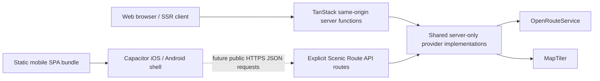

# Native mobile foundation

This milestone adds the build and runtime boundary for distributing Scenic Route in Capacitor 8.
It does not claim store readiness, configure signing, or migrate web capabilities to plugins.

## Shared architecture



The normal `bun run build` remains the SSR/Nitro web deployment. `bun run mobile:build` uses
`vite.mobile.config.ts` to enable TanStack Start SPA shell generation only for the mobile target.
It emits an actual `index.html` and client assets in `mobile-dist/client`; the build-time server
output in `mobile-dist/server` is not copied by Capacitor. The shell loads only the bundled client:
`capacitor.config.ts` intentionally has no `server.url`.

The current provider operations remain behind CSRF-protected, same-origin TanStack server
functions. A Capacitor origin must **not** call those RPC endpoints by weakening CSRF. The next
transport milestone should add narrow, versioned HTTPS API/server routes on the Scenic Route
backend, with explicit origin/authentication/rate-limit policy. Those routes and the existing
server functions should call shared server-only implementations extracted incrementally from the
current `*.server.ts` adapters. This retains one scoring, POI analysis, selection, and Wander domain
model. `VITE_SCENIC_API_BASE_URL` is the centralized public HTTPS origin for that future native
transport; it is not enabled as a substitute `server.url`.

## Security boundary

`OPENROUTESERVICE_API_KEY` and `MAPTILER_API_KEY` are server-only. Never rename either with a
`VITE_` prefix, put either in `VITE_SCENIC_API_BASE_URL`, native resources, Capacitor configuration,
or the mobile bundle. Native requests will be native client → explicit Scenic Route HTTPS API →
shared server-only provider implementation → ORS/MapTiler. Global server-function CSRF protection
remains unchanged. Production traffic must use HTTPS and Capacitor cleartext traffic is disabled.

The application ID `dev.scenicroute.paris` is **provisional for development** and is not claimed to
be registered with Apple or Google. Replace `PROVISIONAL_APP_ID` in `capacitor.config.ts` after the
production identifier is chosen and registered.

## Requirements and workflow

Capacitor 8 requires Node 22+. Bun remains the package manager.

### Scaffold generation status

The Capacitor 8 dependency graph is recorded in `bun.lock`. The `ios/` and `android/`
trees were generated with the official Capacitor CLI and have been synced with the bundled assets
from `mobile-dist/client`. The generated Android project retains Capacitor 8's
`compileSdkVersion` and `targetSdkVersion` of 36.

Scaffold generation and Capacitor sync do not constitute a native compile. Building the iOS app
still requires macOS with Xcode and an explicitly selected Apple team/signing configuration.
Building the Android app still requires a compatible JDK and Android SDK 36. Neither production
signing setup belongs in this repository.

```sh
bun install --frozen-lockfile
bun run mobile:build
bun run mobile:sync            # build, then sync both installed platforms
bun run mobile:sync:ios        # build, then sync iOS only
bun run mobile:sync:android    # build, then sync Android only
bun run mobile:open:ios
bun run mobile:open:android
```

The iOS project requires macOS, Xcode 26 or newer, and Xcode Command Line Tools. Keep Capacitor 8's
generated deployment baseline. A developer must later choose a real Apple team and signing setup;
no fake team, certificate, or provisioning profile belongs in this repository.

The Android project requires Android Studio 2025.2.1 or newer and Android SDK 36. Capacitor 8's
generated Android project targets Android 16/API 36 and can later produce an AAB through the normal
Gradle release task. Play App Signing and a production keystore are intentionally deferred.

## Web capability compatibility audit

| Existing capability | Initial Capacitor status | Planned boundary/configuration |
| --- | --- | --- |
| `getCurrentPosition` | Web API can be retained for initial smoke testing | Move behind a location adapter using `@capacitor/geolocation`; add iOS privacy text and Android runtime permission handling. |
| `watchPosition` | May work in a WebView but is not the release-grade path | Requires the geolocation plugin and later native permission/configuration work; background location remains out of scope. |
| `navigator.share` | Web fallback is safe initially when available | Move behind a share adapter and native-capable plugin/API; retain clipboard fallback. |
| Clipboard API | Safe best-effort fallback initially | Put behind the share adapter if WebView behavior proves inconsistent. |
| `localStorage` | Safe to retain initially for device-local preferences and summaries | Preserve schema/versioning; assess native storage only if lifecycle or capacity needs change. |
| `window.location` | Safe for local navigation and URL construction | Put external/deep-link behavior behind a platform adapter before deep linking. |
| Route-sharing URL fragments | Parsing is safe in the bundled WebView | Universal Links/App Links and cold-start delivery require later deep-link configuration; the HTTPS backend/share URL remains canonical. |

The root viewport continues to use `viewport-fit=cover`. Shared CSS variables expose all four safe
area insets; bottom navigation already consumes the bottom inset. Layout-specific containers should
use these variables only where content can meet a system bar, rather than adding global padding.

## Still to do

1. **Native geolocation:** add `@capacitor/geolocation`, create a web/native location adapter,
   migrate current and watched fixes, add purpose strings and Android permissions, then test denial,
   coarse/precise accuracy, foreground resume, and real walking behavior on devices.
2. **Native sharing and deep links:** add a share adapter, choose the appropriate native plugin,
   configure Universal Links and Android App Links, and test fragment delivery on cold/warm starts.
3. Add production app icons and splash assets.
4. Review iOS privacy strings and required privacy manifests.
5. Review Android runtime permissions without adding background location.
6. **TestFlight preparation:** on macOS, select the registered bundle ID and Apple team, configure
   signing and versioning, complete privacy/icon review, archive in Xcode, validate, then upload to
   App Store Connect for an internal TestFlight build.
7. **Android internal testing:** register the final application ID, configure upload/Play App
   Signing outside source control, run device/API 36 validation, generate and inspect a release AAB,
   then upload it to the Play Console internal track.

Signing, TestFlight, Play submission, payments, authentication, push notifications, and background
location are explicitly outside this foundation milestone.
