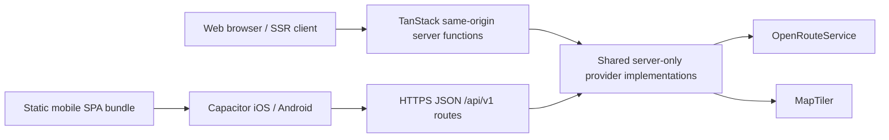
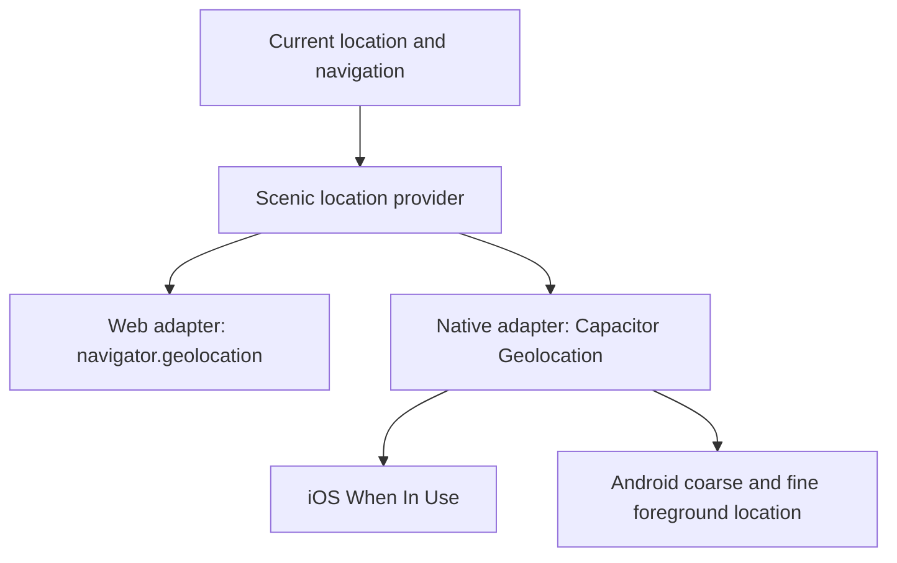

# Native mobile foundation and provider transport

Scenic Route ships a dedicated Capacitor 8 SPA bundle while retaining the TanStack Start SSR web
deployment. Native M2 added the secure provider transport; Native M3 adds foreground-only native
geolocation. Background location, deep links, signing, store delivery, accounts, and payments
remain out of scope.

## M2 architecture



`src/lib/scenic/services.ts` consumes one `ScenicProviderTransport`. Runtime selection happens once
at the centralized platform boundary:

- Web uses the existing TanStack server-function wrappers.
- Capacitor iOS and Android use versioned HTTPS JSON endpoints on the deployed Scenic backend.
- Both paths invoke the same server-only ORS and MapTiler implementations, preserving provider
  timeouts, normalization, caching, route vertices, deterministic E2E fixtures, and unavailable
  results.
- Candidate scoring, corridor analysis, selection, POIs, Wander planning, navigation, and route IDs
  remain shared domain code and are independent of the transport.

The ordinary web build remains SSR and deploys directly as a Cloudflare Worker. Both Vite
configurations compose official project plugins directly; the mobile configuration intentionally
omits the Cloudflare plugin. `bun run mobile:build` uses `vite.mobile.config.ts` to prerender the SPA
shell into `mobile-dist/client`. Capacitor copies only that client directory;
`capacitor.config.ts` intentionally has no `server.url`, so native releases load their local
bundle.

## Native API endpoints

The deployed TanStack Start backend exposes narrow JSON operations:

| Endpoint                         | JSON body               | Controlled provider operation                  |
| -------------------------------- | ----------------------- | ---------------------------------------------- |
| `POST /api/v1/routing/routes`    | `{ from, to }`          | ORS pedestrian route plus bounded alternatives |
| `POST /api/v1/routing/via`       | `{ points }`            | Fixed 2–4 point ORS Wander route               |
| `POST /api/v1/routing/matrix`    | `{ locations }`         | ORS duration Matrix with 2–20 locations        |
| `POST /api/v1/geocoding/search`  | `{ query, proximity? }` | Paris-bounded MapTiler search                  |
| `POST /api/v1/geocoding/reverse` | `{ lat, lng }`          | MapTiler reverse label lookup                  |

The endpoints accept JSON objects only, reject unexpected fields, limit bodies to 16 KiB, validate
latitude/longitude and the supported Paris area, and bound query, waypoint, and Matrix sizes. They
do not accept arbitrary provider URLs, profiles, upstream headers, MapTiler endpoints, or raw
upstream bodies. Malformed requests receive `400`, blocked origins receive `403`, and provider
unavailability receives a controlled `503` response instead of an uncontrolled exception.

## Native transport behavior

`VITE_SCENIC_API_BASE_URL` is public mobile build configuration. It must be exactly the public HTTPS
origin of the Scenic Route backend: no path, query, fragment, provider key, or user information.
Trailing slashes are normalized. The native transport uses bounded timeouts and treats all of the
following as provider unavailability:

- missing or invalid API base configuration;
- offline/network and timeout failures;
- non-2xx responses; and
- non-JSON or malformed JSON responses.

It never attempts same-origin TanStack server functions when native configuration is missing.
Existing seeded geocoding, Preview route, and Wander direct/Preview behavior therefore remains the
product fallback rather than an application crash.

For a deployed mobile build, set the origin at build time and rebuild/sync:

```sh
VITE_SCENIC_API_BASE_URL=https://scenic-backend.example bun run mobile:sync
```

In PowerShell, set `$env:VITE_SCENIC_API_BASE_URL` before the command and remove it afterward. Do
not point a production mobile build at localhost. For local device or simulator development, run
the TanStack backend with the server-only provider keys, expose it through a trusted HTTPS origin
reachable by the device, and build mobile assets with that origin. Plain HTTP is intentionally
rejected.

## CORS and security boundary

CORS and `OPTIONS` handling apply only to `/api/v1/*`; there is no global CORS middleware. The
default exact origin allowlist covers Capacitor's local WebViews:

- `capacitor://localhost`
- `https://localhost`
- `http://localhost`

A deployment can append exact origins with the server-only, comma-separated
`SCENIC_NATIVE_ALLOWED_ORIGINS` variable. This must not be a `VITE_*` variable. Origin is only a
browser-enforced control, not authentication: non-browser clients can imitate an allowed origin.
No supposed secret is embedded in the iOS or Android binary.

`OPENROUTESERVICE_API_KEY` and `MAPTILER_API_KEY` remain server-only. Never rename them with a
`VITE_` prefix or put them in `VITE_SCENIC_API_BASE_URL`, Capacitor configuration, native resources,
or the mobile bundle. Native provider traffic is always:

```text
Capacitor app → Scenic Route HTTPS API → shared server implementation → ORS / MapTiler
```

The server-function CSRF middleware in `src/start.ts` is unchanged and continues filtering
TanStack server-function requests. M2 does not weaken it to accommodate Capacitor.

## Foreground location architecture



The shared contract exposes only latitude, longitude, horizontal accuracy, and timestamp. Browser
`GeolocationPosition` values and Capacitor plugin values are normalized at their adapters, so
current-location and navigation code contain no platform-specific position objects.

The web adapter preserves secure-context checks, high-accuracy intent, the existing timeout and
maximum-age values, browser permission prompts, and browser error mapping. Normal web deployments
do not require Capacitor.

The native adapter uses `@capacitor/geolocation` for both one-shot position requests and foreground
navigation watches. It checks permission before use, requests the plugin's `location` alias only
when the status is promptable, accepts either precise or approximate grants, and does not repeatedly
request after denial. Approximate fixes remain subject to Scenic Route's unchanged 100 metre usable
accuracy threshold. Permission denial maps to the existing location-disabled UI; the message
truthfully directs users to browser or system settings when permission is already off.

Navigation watches exist only while a navigable route is mounted and the document is visible. A
visibility change to hidden clears the browser/native watch; returning to the foreground starts a
fresh permission check and watch. This is the smallest shared WebView resume boundary and must be
confirmed on physical iOS and Android devices because WebView lifecycle delivery can vary.

### Native permissions

iOS declares both `NSLocationWhenInUseUsageDescription` and
`NSLocationAlwaysAndWhenInUseUsageDescription` in `ios/App/App/Info.plist`, using the same product
wording for route progress and nearby discoveries. Capacitor Geolocation's underlying iOS
dependency requires both plist descriptions for compatibility; Scenic Route application logic
still requests and uses foreground/When-In-Use location only. It does not enable a background
location mode.

Android declares only `ACCESS_COARSE_LOCATION` and `ACCESS_FINE_LOCATION` in
`android/app/src/main/AndroidManifest.xml`. Runtime permission handling is delegated to the
Capacitor plugin. There is no `ACCESS_BACKGROUND_LOCATION` or location foreground-service
permission, and API 36 targeting remains unchanged.

Precise one-shot fixes and continuous navigation fixes remain memory-only. GPS history is not added
to localStorage, route feedback, analytics, API payloads, or the persisted current-location trip
endpoint. Background location is not implemented.

## Requirements and workflow

Capacitor 8 requires Node 22+. Bun remains the package manager.

```sh
bun install --frozen-lockfile
bun run test
bun run build
bun run mobile:build
bun run mobile:sync
```

The Capacitor dependency graph is recorded in `bun.lock`. The `ios/` and `android/` projects were
generated in Native M1 and are not regenerated by M2. The generated Android project retains
Capacitor 8's compile and target SDK 36 configuration.

Capacitor sync is not a native compile. iOS compilation requires macOS, Xcode 26 or newer, Xcode
Command Line Tools, a registered bundle ID, and an explicitly selected Apple team/signing setup.
Android compilation requires a compatible JDK, Android Studio 2025.2.1 or newer, and Android SDK 36. Play App Signing and production keystores stay outside source control.

## Existing web capability compatibility

| Capability                             | Current native foundation                                                      | Later work                                                                                                                                                                      |
| -------------------------------------- | ------------------------------------------------------------------------------ | ------------------------------------------------------------------------------------------------------------------------------------------------------------------------------- |
| `getCurrentPosition` / `watchPosition` | Central web/native adapter uses browser or Capacitor Geolocation while visible | Physical-device validation is still required for permission denial, approximate/precise fixes, foreground resume, and walking accuracy. Background location is not implemented. |
| `navigator.share` / clipboard          | Existing best-effort web behavior remains                                      | Add a centralized share adapter before native sharing changes.                                                                                                                  |
| `localStorage`                         | Retains device-local schema/versioning                                         | Reassess only if lifecycle or capacity evidence requires native storage.                                                                                                        |
| Route-sharing fragments                | Parse inside the bundled WebView                                               | Universal Links/App Links and cold-start delivery require a later deep-link milestone.                                                                                          |

The root viewport continues to use `viewport-fit=cover`; existing safe-area variables remain the
layout boundary for content near system bars.

## Native M3.2 Android backend validation

On 2026-08-22, the debug application was rebuilt with JDK 21 and exercised on the existing Pixel 9
Android API 36 emulator. Its Capacitor WebView used the `https://localhost` origin and the
gitignored `.env.mobile.local` value for direct transport to
`https://scenic-route.derrickhunt0.workers.dev`. Live MapTiler landmark, address, neighborhood, and
reverse-geocoding requests succeeded through `/api/v1/geocoding/*`; live ORS route alternatives,
Matrix, and via requests succeeded through `/api/v1/routing/*`. No native request went directly to
MapTiler or ORS.

Fastest, Scenic, and Explorer rendered real pedestrian geometry in MapLibre with non-zero time and
distance, truthful route rationale, and curated discoveries. A 60-minute Wander produced a live
54-minute route after fixing Wander provider payloads to serialize coordinate-only waypoint
objects. A development-only unreachable backend build launched safely, used seeded search
suggestions, and presented route and Wander previews without same-origin server-function or direct
provider fallback. The production Worker origin was restored and the APK rebuilt afterward.

Simulated foreground GPS advanced an Explorer route from 0% to 50% to 100%, updated remaining
distance/time and discovery sequencing, and preserved the route across background/foreground.
Android removed the hidden location watch and registered one fresh watch on resume; no crash or
duplicate active watch was observed. This was emulator/simulated-GPS validation, not physical
walking validation. Permission behavior, lifecycle delivery, GPS accuracy, and walking behavior
still require a physical Android device (and later iOS validation). Rate limiting remains the major
infrastructure blocker before a broader external beta.

## Recommended next native milestone

Run the same permission, foreground-resume, route-progress, and walking checks on a physical
Android device, then repeat them on iPhone when macOS and Xcode are available. After that field
proof, M4 can address native sharing and deep links as a separate milestone. Do not add background
location to either scope.
